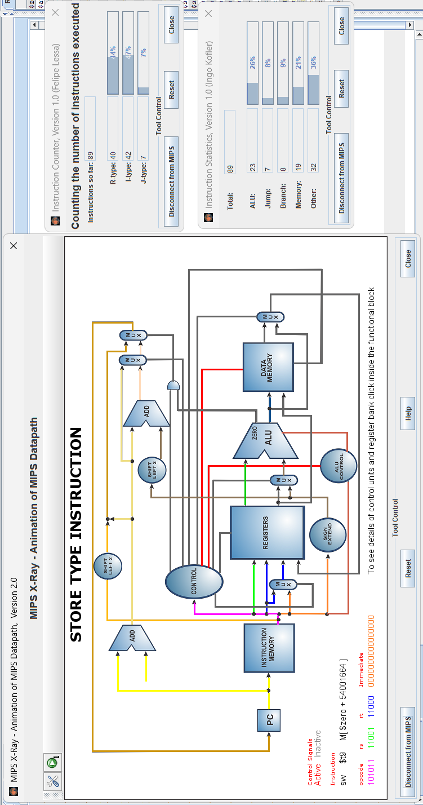
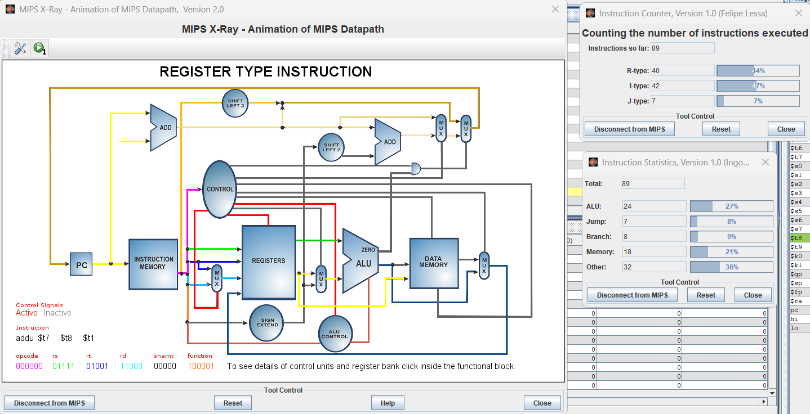

# Informe de Laboratorio: Estructura de Computadores

**Nombre del Estudiante:** Edward Asmed Alvarez Largo  
**Fecha:** 2/03/2026  
**Asignatura:** Estructura de Computadores
 
**Enlace del repositorio en GitHub:** [agregar enlace Aquí]  
 

---

## 1. Análisis del Código Base
El programa opera la ecuacion lineal 
Y[i]=A⋅X[y]+B
Con un bucle en assembler que recorre un vector de 8 elementos en 5 etapas 
### 1.1. Evidencia de Ejecución
Adjunte aquí las capturas de pantalla de la ejecución del `programa_base.asm` utilizando las siguientes herramientas de MARS:
*   **MIPS X-Ray** (Ventana con el Datapath animado).
*   **Instruction Counter** (Contador de instrucciones totales).
*   **Instruction Statistics** (Desglose por tipo de instrucción).



### 1.2. Identificación de Riesgos (Hazards)
Completa la siguiente tabla identificando las instrucciones que causan paradas en el pipeline:

| Instrucción Causante | Instrucción Afectada | Tipo de Riesgo (Load-Use, etc.) | Ciclos de Parada |
|----------------------|----------------------|---------------------------------|------------------|
| `lw $t6, 0($t5)`     | `mul $t7, $t6, $t0`  | Load-Use                        |1                 |
|  mul $t7, $t6, $t0   |  addu $t8, $t7, $t1  | RAW                             |0 (con forwarding)|

### 1.2. Estadísticas y Análisis Teórico
Dado que MARS es un simulador funcional, el número de instrucciones ejecutadas será igual en ambas versiones. Sin embargo, en un procesador real, el tiempo de ejecución (ciclos) varía. Completa la siguiente tabla de análisis teórico:

| Métrica                                      | Código Base | Código Optimizado |
|----------------------------------------------|-------------|-------------------|
| Instrucciones Totales (según MARS)           |89           |89                 |
| Stalls (Paradas) por iteración               |1            |0                  |
| Total de Stalls (8 iteraciones)              |8            |0                  |
| **Ciclos Totales Estimados** (Inst + Stalls) |97           |89                 |
| **CPI Estimado** (Ciclos / Inst)             |1.09         |1.00               |
---

## 2. Optimización Propuesta
El código base presentaba un riesgo de datos tipo Load-Use, en las  instrucciones lw y mul dentro del bucle principal.
En un procesador MIPS de 5 etapas (IF, ID, EX, MEM, WB), el valor cargado por lw está disponible después de la etapa MEM. pero, la instrucción mul requiere ese operando en la etapa EX en el siguiente ciclo, lo que provoca la inserción de un ciclo estatico (stall).
Para eliminar este error de optimizacion, reordené las instrucciones , moviendo una instrucción independiente entre el lw y el mul.

### 2.1. Evidencia de Ejecución (Código Optimizado)
Adjunte aquí las capturas de pantalla de la ejecución del `programa_optimizado.asm` utilizando las mismas herramientas que en el punto 1.1:
*   **MIPS X-Ray**.
*   **Instruction Counter**.
*   **Instruction Statistics**.



### 2.2. Código Optimizado
Pega aquí el fragmento de tu bucle `loop` reordenado:

```asm
# Pega tu código aquí
```

### 2.2. Justificación Técnica de la Mejora
Explica qué instrucción moviste y por qué colocarla entre el `lw` y el `mul` elimina el riesgo de datos:

Esta instrucción no depende del valor cargado por lw, por lo que puede ejecutarse inmediatamente después sin generar conflictos.

Al colocarla entre el lw y el mul, se introduce una instrucción intermedia que permite que el dato cargado complete su etapa MEM antes de ser utilizado en la etapa EX por la instrucción mul.

## 3. Comparativa de Resultados

| Métrica          | Código Base | Código Optimizado | Mejora (%) |
|------------------|-------------|-------------------|------------|
| Ciclos Totales   |97           | 89                | 8.25%      |
| Stalls (Paradas) |8            | 0                 | 100%       |
| CPI              |1.09         | 1.00              | 8.25%      |

---

## 4. Conclusiones
¿Qué impacto tiene la segmentación en el diseño de software de bajo nivel? ¿Es siempre posible eliminar todas las paradas?

la segmenatacion es increiblemente util para mejorar el rendimientos por medio de la super posicion de etapas de ejecucion, pero asume tambien riesgos de datos si existen dependencias entre instrucciones consecutivas

En este laboratorio se identificó un riesgo tipo RAW (Read After Write), específicamente un caso de Load-Use, donde una instrucción mul dependía inmediatamente del resultado cargado por una instrucción lw. En un procesador real segmentado, esta situación genera ciclos de parada (stalls), aumentando el CPI y reduciendo el rendimiento efectivo.

Por medio de el reordenamiento de instrucciones fue posible eliminar el stall insertando la instruccion independiente entre las dos dependientes 

Esta optimización redujo los ciclos totales estimados de 97 a 89 y el CPI de 1.09 a 1.00, logrando una mejora aproximada del 8.25% sin alterar la funcionalidad del programa